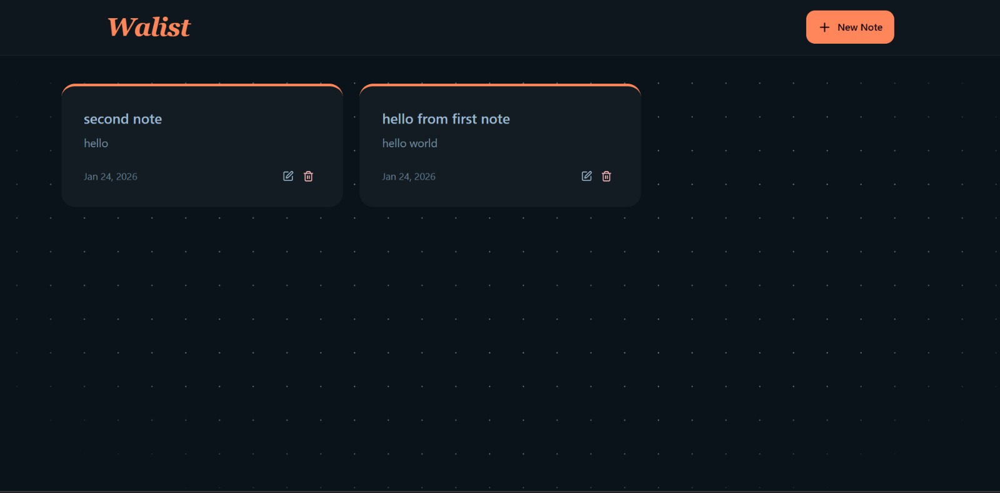

# 📝 Walist - MERN Note Taking App

> A modern, responsive note-taking application built with the MERN Stack and containerized with Docker.


</br>
</br>


## 📖 About The Project

Walist is a full-stack application that allows users to manage their personal notes efficiently. It demonstrates a complete implementation of CRUD operations, utilizes **Redis** for API rate limiting, and is fully containerized for easy deployment.

### Key Features
* ✨ **Create, Read, Update, Delete (CRUD)** notes.
* ⚡ **Rate Limiting** using Upstash Redis to prevent API abuse.
* 🎨 **Modern UI** with TailwindCSS & DaisyUI.
* 🐳 **Dockerized** for consistent development and deployment environments.
* 🚀 **Fast Build Tooling** using Vite.

---

## 🛠️ Tech Stack

### Frontend
* **React.js** (v19)
* **Vite** (Build Tool)
* **TailwindCSS & DaisyUI** (Styling)
* **Axios** (API Requests)

### Backend
* **Node.js & Express.js**
* **MongoDB Atlas** (Database)
* **Mongoose** (ODM)
* **Upstash Redis** (Rate Limiting)

### DevOps
* **Docker & Docker Compose**

---

## 🚀 Getting Started (Docker Mode)

The easiest way to run this application is using Docker. You don't need to install Node.js or Mongo locally.

### Prerequisites
* [Docker Desktop](https://www.docker.com/products/docker-desktop) installed and running.

### Installation Steps

1.  **Clone the repository**
    ```bash
    git clone [https://github.com/walidan-nadilaw/MERNote.git](https://github.com/walidan-nadilaw/MERNote.git)
    cd MERNote
    ```

2.  **Setup Environment Variables**
    Create a `.env` file in the **`backend`** folder:
    ```bash
    # backend/.env
    PORT=5001
    MONGO_URI=your_mongodb_connection_string
    UPSTASH_REDIS_REST_URL=your_upstash_url
    UPSTASH_REDIS_REST_TOKEN=your_upstash_token
    NODE_ENV=development
    ```

3.  **Run with Docker Compose**
    Build and start the containers:
    ```bash
    docker-compose up --build
    ```

4.  **Access the App**
    * Frontend: `http://localhost:5173`
    * Backend API: `http://localhost:5001`

---

## ⚙️ Manual Installation (Without Docker)

If you prefer running it manually on your machine:

**1. Backend Setup**
```bash
cd backend
npm install
# Ensure .env file is created as shown above
npm start
```

**2. Frontend Setup**
```bash
cd frontend
npm install
npm run dev
```


